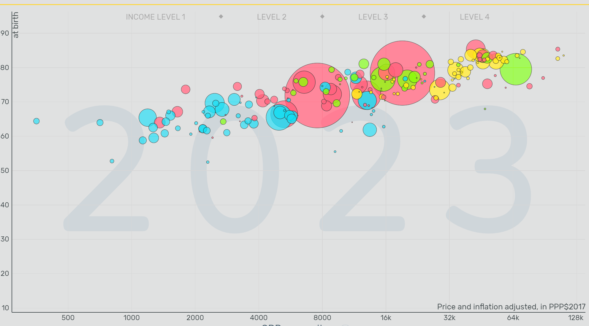
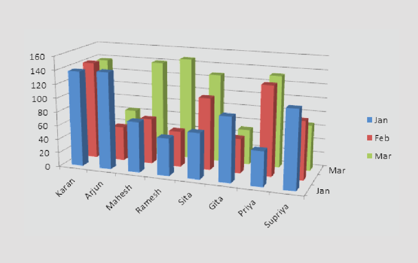

```{r setup, include=FALSE}
## **DO NOT EDIT THIS CODE CHUNK**
knitr::opts_chunk$set(echo = TRUE)
library(tidyverse)
```

```{r}
strava_runs <- read_csv("data/strava_runs.csv")
```

```{r}
data_5k_10k <- strava_runs %>%
  mutate(
    event = case_when(
      distance..m. > 4998 & distance..m. < 5015  ~ "5k",
      distance..m. > 9998 & distance..m. < 10015 ~ "10k",
      TRUE ~ NA_character_
    )
  ) %>%
  filter(!is.na(event))
```


## Exercise 1

```{r ex1a, out.width="80%"}

data_5k_10k %>%
  filter(gender == "M") %>%
  filter(!is.na(average.heart.rate..bpm.)) %>%
  ggplot(aes(x = average.heart.rate..bpm.)) +
  geom_histogram(bins = 20)

```

The distribution of average heart rate for male runners is uni modal and roughly symmetric with most observations between about 135 and 165 bpm. The center lies just under 150 bpm, and only a handful of efforts fall below 120 bpm or above 180 bpm, so extreme values are rare and the spread is moderate.

```{r ex1b, out.width="80%"}

data_5k_10k %>% 
  filter(gender == "F") %>%
  filter(!is.na(average.heart.rate..bpm.)) %>%
  ggplot(aes(x = average.heart.rate..bpm.)) + 
  geom_histogram(bins = 20)

```


The distribution of average heart rate for female runners appears bimodal, with two clear peaks around 145 bpm and 165 bpm.This indicates the presence of two subgroups within the sample with them possibly being 5k and 10k.The mean lies just under 160 bpm with a relatively high variation.


## Exercise 2

```{r ex2, out.width = "80%"}
data_5k_10k %>%
  filter(!is.na(gender)) %>%
  ggplot(aes(y = ((elapsed.time..s.)/60/((distance..m.)/1000)), fill = event)) +
  geom_boxplot() +
  labs(
    title = "Pace (min/km) for 5K vs 10K runs",
    x = "Event",
    y = "Pace (min/km)",
    caption = "Outliers shown as points."
  ) +
  facet_wrap(~ gender)


```

The boxplots show that for both male and female runners, 10K runs have a slightly lower median pace compared to 5K runs.The 5K distribution is more variable, with a larger interquartile range and several slower outliers, suggesting that the shorter event attracts a wider range of running abilities.


## Exercise 3

```{r ex3, out.width = "80%"}

avg_distance <- strava_runs %>%
  group_by(athlete) %>%
  summarise(mean_distance_km = mean(distance..m.) / 1000)

runner_type <- avg_distance %>%
  mutate(type = case_when(
    mean_distance_km > 13 ~ "Long-distance",
    mean_distance_km < 7  ~ "Short-distance",
    TRUE                  ~ NA
  )) %>%
  filter(!is.na(type))

data_scatter <- strava_runs %>%
  left_join(runner_type, by = "athlete") %>%
  transmute(
    type,
    distance_km   = distance..m. / 1000,
    avg_speed_mps = distance..m./elapsed.time..s.
  ) %>%
  filter(!is.na(type), !is.na(distance_km), !is.na(avg_speed_mps))


ggplot(data_scatter,
       aes(x = distance_km, y = avg_speed_mps, colour = type)) +
  geom_point(alpha = 0.6, size = 2) +
  stat_smooth(method = "lm",  se = FALSE, linewidth = 1.1) +
  scale_colour_manual(values = c("Short-distance" = "forestgreen",
                                 "Long-distance"  = "orange")) +
  labs(
    title = "Average Speed vs Distance",
    subtitle = "Comparison of short- and long-distance runners",
    x = "Distance (km)",
    y = "Average speed (m/s)",
    colour = "Runner type")


```


## Exercise 4

#### Example of a good data visualisation

```{r ex4_good_viz, echo = FALSE, out.width = "80%"}
# edit the file path accordingly

```


**Bubbles**, "**gapminder**" [Online]. Available at: **https://www.gapminder.org/tools/#$chart-type=bubbles&url=v2** (Accessed: **31 10 2025**)


The above image presents a good data visualisation because:

-   Two clear quantitative variables, continents and population, are easily understandable through the color and size. 
-   Color palette is distinct yet easy to comprehend.


#### Example of a bad data visualisation


```{r ex4_bad_viz, echo = FALSE, out.width = "80%"}
# edit the file path accordingly

```


**Data-to-Viz.com**, "**data-to-viz**" [Online]. Available at: **https://www.data-to-viz.com/caveat/3d.html** (Accessed: **31 10 2025**)


The above image presents a bad data visualisation because:

-   3-D perspective distorts slice size perception.
-   No clear ordering or percentages labelled.


